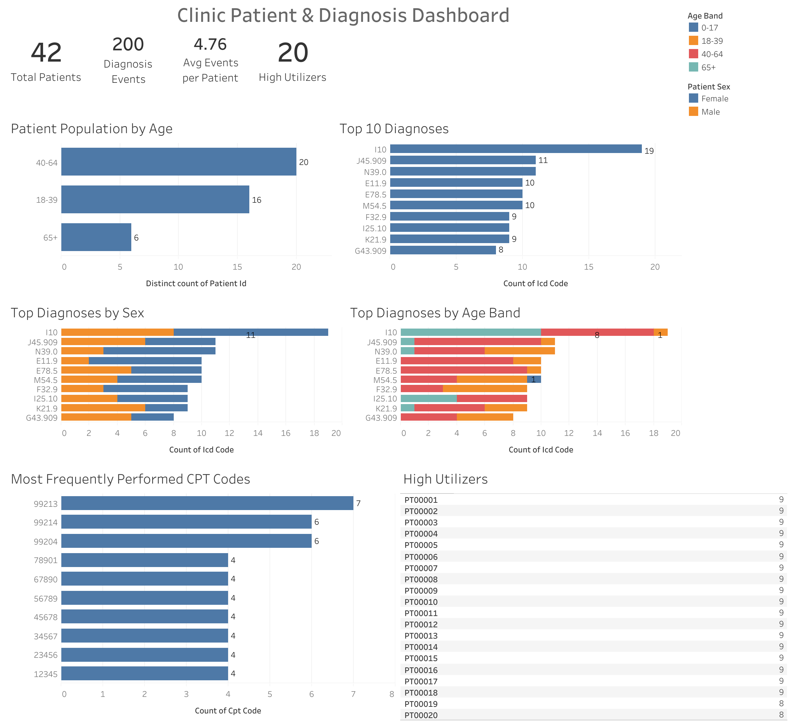

# Healthcare Clinic Patient & Diagnosis Analysis

An end-to-end healthcare data analysis project examining patient demographics, diagnosis patterns, visit utilization, and commonly performed procedures.

## Dashboard Preview

## Live Dashboard

[View the interactive Tableau dashboard](PASTE_YOUR_TABLEAU_PUBLIC_LINK_HERE)

## Project Overview

This project analyzes a synthetic healthcare clinic dataset containing 200 diagnosis events across 42 patients. The analysis helps the clinic understand its patient population, commonly treated conditions, patient utilization, and frequently performed CPT procedures.

## Key Findings

- 42 unique patients
- 200 diagnosis events
- 4.76 average diagnosis events per patient
- 20 high utilizers with four or more events
- The 40–64 age group represents the largest patient segment
- ICD code I10 is the most frequently recorded diagnosis
- CPT code 99213 is the most frequently performed procedure

## Dashboard Features

- Patient population by age band
- Top 10 diagnoses
- Diagnoses by age band and sex
- Average events per patient
- High-utilizer identification
- Most frequently performed CPT procedures

## Tools Used

- Excel and Power Query for cleaning and preliminary analysis
- SQL Server for validation and analytical queries
- Tableau Public for visualization and dashboard development

## Repository Contents

- `patient_visits.csv` — original synthetic dataset
- Excel workbook — cleaned data and PivotTable analysis
- SQL script — validation and analytical queries
- Tableau workbook — interactive dashboard source
- Dashboard screenshot — preview of the completed dashboard

## Data Notice

This project uses entirely synthetic healthcare data and contains no real patient information.
